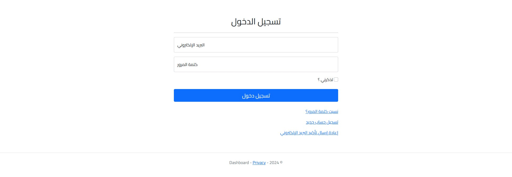
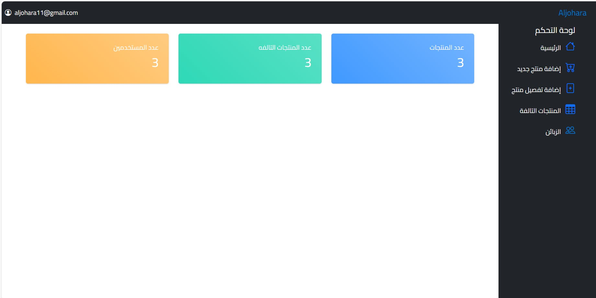
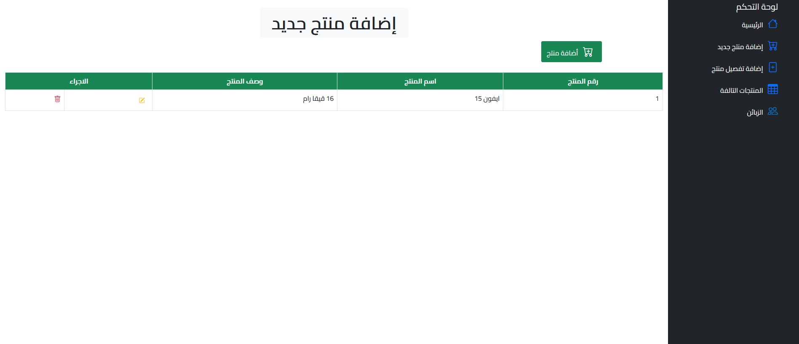
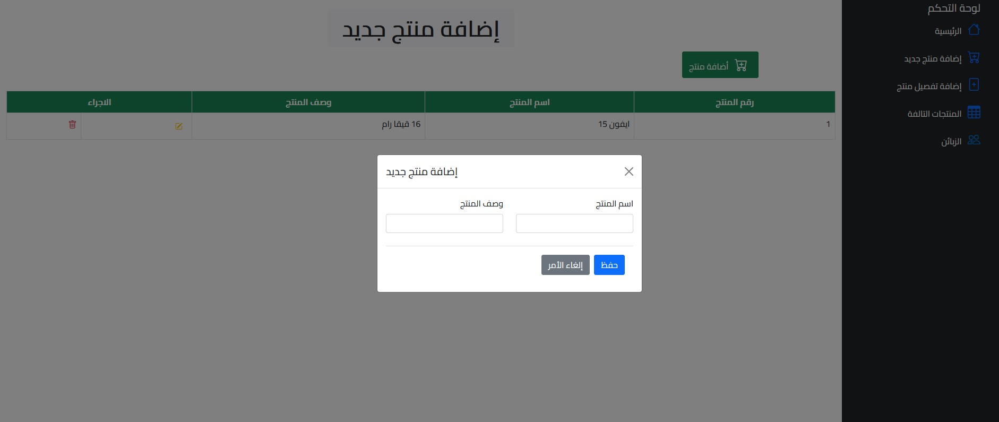
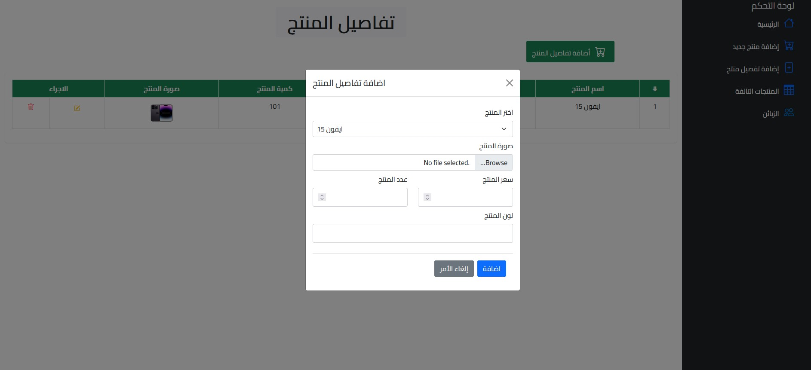
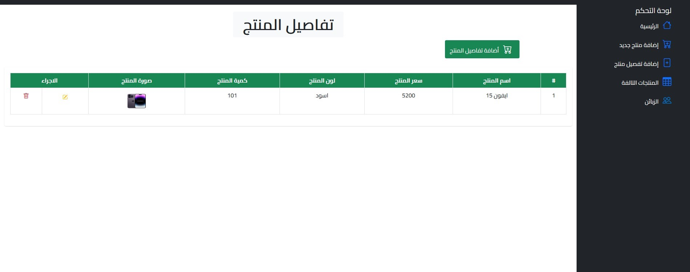
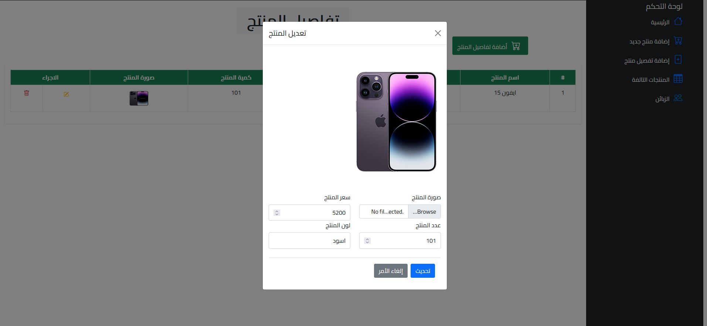
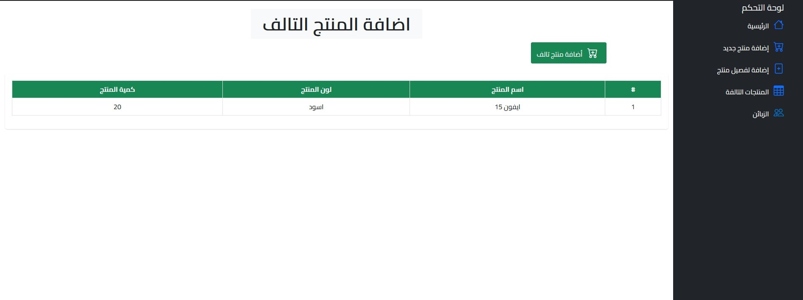

# Dashboard

Dashboard is a simple web application built with ASP.NET Core MVC. It allows users to manage products, including adding new products, editing existing products, adding damaged products, and managing product details. The application provides a user-friendly interface to handle various product management tasks efficiently.

### Thanks 
